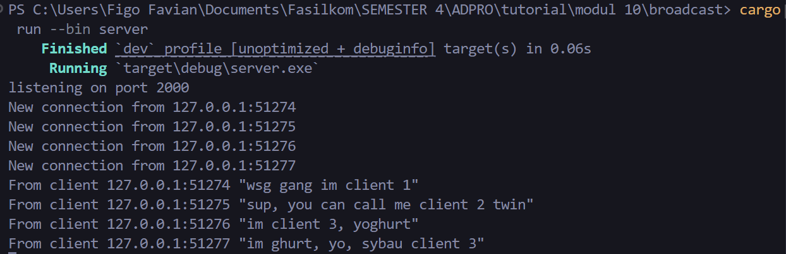
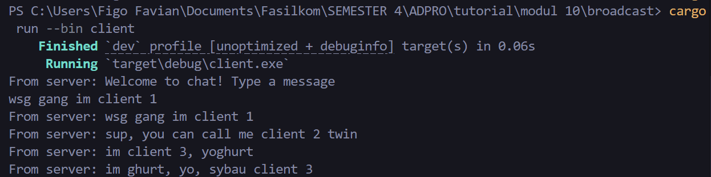
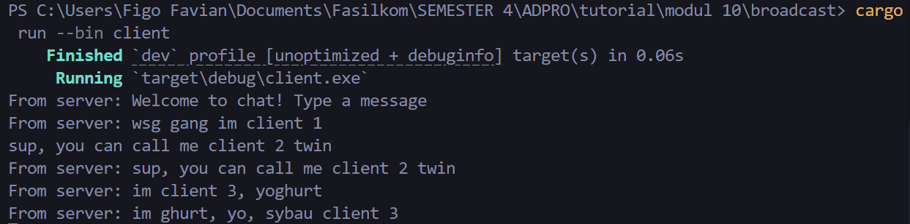
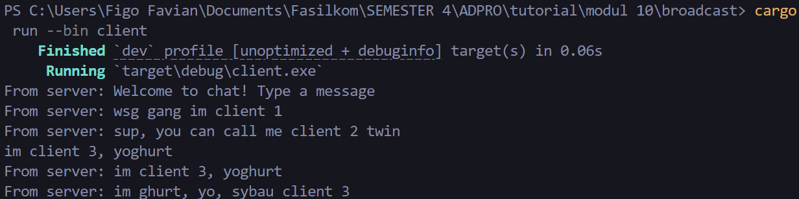
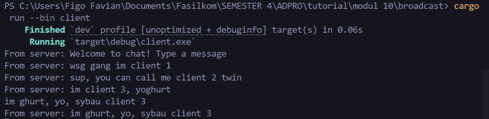
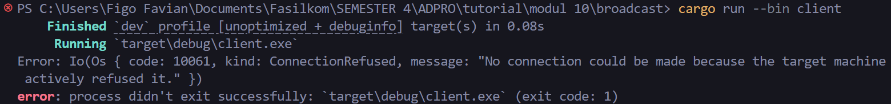
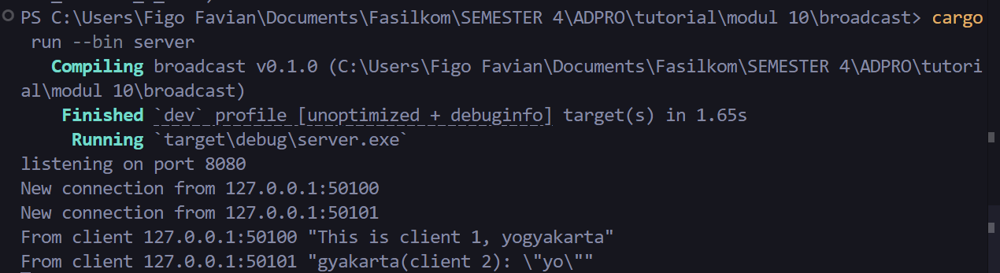
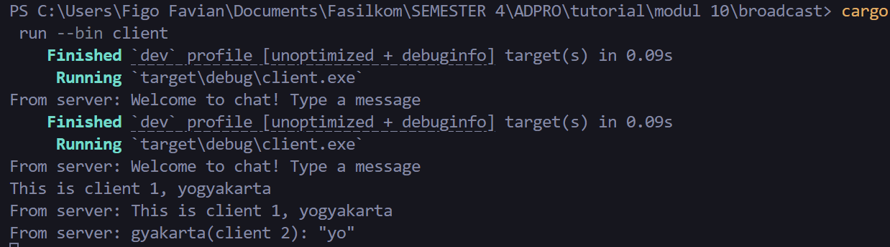
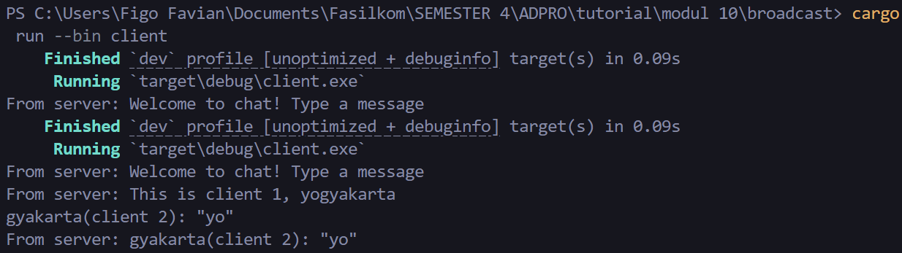

## 2.1 Original code and How It Runs

### Server 

Server memiliki kewajiban sebagai _listener_ yang menerima _connection_ dari setiap Client. Server akan menerima tiap pesan dari berbagai Client dan kemudian akan memberitakan pesan yang baru. Client dapat menerima pesan dari Client lainnya yang terkoneksi ke Server.

Bukti:

### Client 1 

bukti:

### Client 2 

bukti:

### Client 3 

bukti:

### Client 4

bukti:

##  2.2: Modifying the websocket port 

Jika port berbeda (Antar client dan server) maka akan error. Hal ini terjadi karena Client tidak menemukan target Server dengan port yang sesuai.

Bukti:

Namun jika kedua port (di client dan sever) sama, semisal keduanya diubah ke port 8080, maka akan berhasil dan broadcast akan berjalan seperti biasanya.

Bukti:

